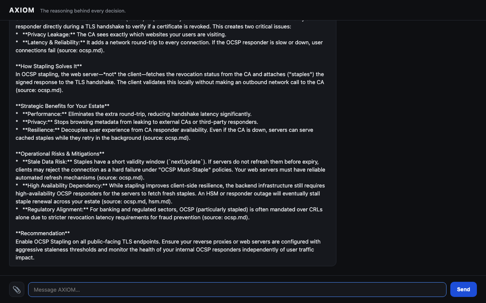

# AXIOM
**The reasoning behind every decision.**

AXIOM is a locally-run personal AI assistant built for Carter Tan — a Solutions Architect specialising in PKI and AI security. It runs entirely on-device via Ollama, with no cloud calls and no data leaving your machine. AXIOM classifies your intent, routes it to the right model, drafts emails in your voice, summarises meeting notes in structured format, analyses RFPs, answers PKI questions grounded in a local knowledge base, and runs research tasks — from the terminal or a browser. Memory persists across sessions via ChromaDB.

---

## The Five-Layer Vision

AXIOM is being built up toward a JARVIS-style assistant, one layer at a time:

1. **Brain** — local LLM routing and reasoning, no cloud dependency (Phase 1)
2. **Personality & Memory** — a consistent identity across every agent, with persistent episodic memory (Phase 2)
3. **Domain Expertise** — specialised agents (RFP, PKI Q&A, Research) backed by a retrieval-augmented knowledge base (Phase 2)
4. **Interface** — reachable from a terminal or a browser, with file upload, not just a CLI (Phase 2)
5. **Autonomy** — proactive web research, calendar/email awareness, and scheduled tasks (Phase 3+)

---

## Phase 1 Capabilities

- **Email drafting** — professional emails in Carter's voice (qwen3.6:27b)
- **Meeting summaries** — structured 6-section output from raw notes (granite4.1:30b)
- **General Q&A** — fast answers for cybersecurity and architecture questions (gemma4:e4b)
- **Intent routing** — automatic task classification, no manual flags needed (gemma4:e4b)
- **Persistent memory** — ChromaDB episodic memory across sessions (nomic-embed-text)
- **Benchmark mode** — compare all models on any task, logs to CSV
- **Rich terminal UI** — colour-coded output panels, task/model/latency metadata

## Phase 2 Capabilities

- **AXIOM personality layer** — a consistent identity (calm, direct, never sycophantic) injected into every agent's system prompt
- **RFP analysis agent** — extracts requirements, compliance items, gaps, and response strategy (qwen3:30b, thinking mode)
- **PKI Q&A agent** — answers PKI/certificate questions grounded in a local knowledge base, with source citations (qwen3.6:27b + RAG)
- **Research agent** — structured analytical research on markets, vendors, and technologies (deepseek-r1:32b)
- **Web interface** — full chat UI in the browser, with PDF upload and colour-coded response badges
- **PKI knowledge base** — Markdown knowledge files indexed into ChromaDB and retrieved via semantic search

## Phase 4 Capabilities

- **Voice interface** — `axiom voice` launches a push-to-talk loop: press ENTER to speak, ENTER again to stop
- **Local STT** — whisper.cpp with Metal GPU acceleration, large-v3-turbo model (~100ms transcription, works with PKI vocabulary)
- **Local TTS** — Voxtral TTS (MLX 4-bit), downloads and caches automatically on first run; starts speaking before the full response is generated (streaming)
- **Speech text cleaning** — markdown, URLs, bullet points, and code fences stripped for natural spoken delivery; numbered lists converted to "First, Second..."
- **Full loop** — transcript and full text always printed alongside audio, so you can read long technical answers
- **Zero cloud** — voice never leaves the Mac (~$3/month in power vs $86+/month for cloud STT/TTS)

## Phase 3 Capabilities

- **Multi-agent orchestration** — three selectable modes for quality-first results:
  - **Ensemble** — sends the same prompt to multiple models sequentially, then a synthesiser combines them into the best answer
  - **Pipeline** — models refine each other's output in stages: draft → refine → polish
  - **Debate** — models answer independently, critique each other, then a judge selects/synthesises the best final answer
- **Task management** — natural-language task add/list/done, stored in local SQLite (`data/tasks.db`): `axiom task add "…"`, `axiom task list`
- **Live web research** — DuckDuckGo search + page fetch + synthesis with source citations (`axiom research "…"`); search layer is pluggable (Brave/SearXNG configurable via `web_search.backend`)
- **Email sending** — drafts via EmailAgent, reads back to/subject/body, then sends via macOS Mail using AppleScript — no SMTP credentials, no cloud
- **Safety gate** — every external action (email send, future calendar events) passes through `SafetyGate.confirm_action()`, which prompts for explicit `yes` before proceeding
- **Benchmark runner** — interactive quality-rated benchmark (`axiom benchmark --task pki_qa`): rate each response 1-5, composite score = quality×0.6 + speed×0.25 + efficiency×0.15
- **Benchmark dashboard** — HTML dashboard with Chart.js bar charts, latency/speed/quality table, and a `config/models_recommended.yaml` for Carter to review before merging into `models.yaml`
- **Web UI mode selector** — dropdown in the browser chat to select Single / Ensemble / Pipeline / Debate; multi-model results show expandable per-model responses
- **GLM-5.2 evaluation** — assessed as not viable locally (1.51TB, requires 256GB+ RAM); documented as optional API fallback only

---

## Requirements

- Python 3.11+
- [Ollama](https://ollama.com) running locally (`ollama serve`)
- Models pulled:

| Model | Purpose |
|---|---|
| `qwen3.6:27b` | Email drafting, PKI Q&A |
| `granite4.1:30b` | Meeting summaries |
| `gemma4:e4b` | General Q&A, intent routing |
| `deepseek-r1:32b` | Research tasks |
| `qwen3:30b` | RFP analysis fallback |
| `nomic-embed-text` | ChromaDB embeddings |

Pull all models:
```bash
ollama pull qwen3.6:27b && ollama pull granite4.1:30b && ollama pull gemma4:e4b
ollama pull deepseek-r1:32b && ollama pull qwen3:30b && ollama pull nomic-embed-text
```

### Voice Prerequisites (Phase 4)

whisper.cpp must be built locally with Metal support:

```bash
cd ~/AI-Projects
git clone https://github.com/ggml-org/whisper.cpp
cd whisper.cpp
cmake -B build -DWHISPER_METAL=ON
cmake --build build -j --config Release
bash ./models/download-ggml-model.sh large-v3-turbo
```

Verify:
```bash
~/AI-Projects/whisper.cpp/build/bin/whisper-cli \
  -m ~/AI-Projects/whisper.cpp/models/ggml-large-v3-turbo.bin \
  -f ~/AI-Projects/whisper.cpp/samples/jfk.wav
```

Voxtral TTS (MLX) is downloaded automatically on first `axiom voice` run. macOS will prompt for microphone permission on first use — grant it in System Settings → Privacy & Security → Microphone.

---

## Installation

```bash
git clone https://github.com/cartertan/axiom.git
cd axiom
pip install -r requirements.txt
cp .env.example .env
```

---

## Usage

### Single-task mode
```bash
python3 axiom.py "draft a follow-up email to the Singtel security team"
python3 axiom.py "summarise these meeting notes: [paste notes here]"
python3 axiom.py "what is OCSP stapling and how do I explain it to a CIO?"
```

### Orchestration modes
```bash
python3 axiom.py "analyse this RFP requirement: must support ACME and HSM" --mode ensemble
python3 axiom.py "write a proposal opening for a telco PKI refresh" --mode pipeline
python3 axiom.py "OCSP vs CRL for a high-traffic bank — which and why" --mode debate
```
RFP_ANALYSIS and RESEARCH tasks auto-default to ensemble if no `--mode` is given.

### Task management
```bash
python3 axiom.py task add "Follow up with Singtel security team by Friday"
python3 axiom.py task list
python3 axiom.py task done "Singtel"
```

### Live web research
```bash
python3 axiom.py research "Thales PKI telco strategy 2026"
```
Searches DuckDuckGo, fetches top pages, returns a cited synthesis.

### Email sending
```bash
python3 axiom.py "send a meeting confirmation to john@example.com"
```
Drafts the email, reads back to/subject/body, prompts for confirmation before sending via macOS Mail.

### Benchmark mode
```bash
python3 axiom.py benchmark --task pki_qa   # interactive quality-rated benchmark
python3 axiom.py benchmark                  # quick latency table (no rating prompt)
```

### Voice interface
```bash
python3 axiom.py voice
```
Press ENTER to start speaking. AXIOM transcribes locally (whisper.cpp), routes the task, runs the appropriate agent, then speaks the answer back (Voxtral TTS). Press ENTER again to speak another query. Type `quit` to exit.

**First run:** Voxtral downloads automatically (~2.5GB, cached at `~/.cache/huggingface/`). whisper.cpp must be built at `~/AI-Projects/whisper.cpp/` — see **Voice Prerequisites** below.

### Interactive mode
```bash
python3 axiom.py
```
Type your task at the `axiom>` prompt. Type `quit` to exit.

### Web interface
```bash
python3 server.py
```
Open `http://localhost:8000` in a browser. Local only — binds to `127.0.0.1`, never `0.0.0.0`.

- Chat with AXIOM the same way as the CLI; responses show a badge with task type, model, and latency
- Upload a PDF (📎) to extract its text straight into the message box
- All processing stays local — the web server calls the same Ollama instance as the CLI



---

## PKI Knowledge Base

`knowledge/pki/` holds Markdown reference files (OCSP, CRLs, certificate lifecycle, HSMs, post-quantum crypto) written for a presales solutions architect. They're chunked, embedded with `nomic-embed-text`, and stored in a dedicated ChromaDB collection (`axiom_pki_knowledge`) separate from episodic memory.

The `PKIAgent` retrieves relevant chunks for every PKI question and cites the source file inline. To rebuild the index after editing or adding knowledge files:

```bash
python3 -c "
from src.rag.indexer import PKIIndexer
PKIIndexer().rebuild()
"
```

---

## Project Structure

```
axiom/
├── axiom.py                    # CLI entry point
├── server.py                   # Web entry point
├── config/
│   ├── models.yaml              # Model assignments + orchestration config
│   ├── models_recommended.yaml  # Benchmark output — review before merging
│   └── personality.yaml         # AXIOM identity, character, rules
├── memory/carter_profile.json  # Carter DNA — injected into every prompt
├── knowledge/pki/              # PKI reference Markdown, indexed for RAG
├── reports/
│   └── benchmark_dashboard.html # Generated benchmark dashboard
├── src/
│   ├── core/
│   │   ├── ollama_client.py    # All Ollama API calls
│   │   ├── orchestrator.py     # Multi-model orchestration (ensemble/pipeline/debate)
│   │   ├── profile.py          # Profile loader
│   │   ├── personality.py      # AXIOM personality layer
│   │   ├── memory.py           # ChromaDB read/write
│   │   └── router.py           # Intent classification
│   ├── actions/
│   │   ├── safety_gate.py      # Confirm gate for all external actions
│   │   └── web_search.py       # DuckDuckGo search + page fetch (pluggable backend)
│   ├── agents/
│   │   ├── base_agent.py       # Abstract base class
│   │   ├── email_agent.py      # Email drafting
│   │   ├── email_sender_agent.py  # Email send via macOS Mail + safety gate
│   │   ├── meeting_agent.py    # Meeting summaries
│   │   ├── general_agent.py    # General Q&A
│   │   ├── rfp_agent.py        # RFP analysis
│   │   ├── pki_agent.py        # PKI Q&A (RAG)
│   │   ├── research_agent.py   # Model-knowledge research
│   │   ├── research_web_agent.py  # Live web research with citations
│   │   └── task_agent.py       # Task management (SQLite)
│   ├── rag/
│   │   ├── indexer.py          # PKI knowledge base indexer
│   │   └── retriever.py        # PKI semantic retrieval
│   ├── benchmark/
│   │   ├── logger.py           # CSV benchmark logger
│   │   ├── runner.py           # Interactive quality-rated benchmark runner
│   │   └── dashboard.py        # HTML dashboard generator
│   ├── voice/
│   │   ├── stt.py              # SpeechToText — wraps whisper.cpp via subprocess
│   │   ├── recorder.py         # PushToTalkRecorder — ENTER-to-toggle mic capture
│   │   ├── tts.py              # TextToSpeech — Voxtral TTS (MLX 4-bit), streaming
│   │   ├── text_cleaner.py     # clean_for_speech() — strips markdown for TTS
│   │   └── voice_loop.py       # VoiceLoop — full STT→agent→TTS conversational loop
│   └── interface/
│       ├── cli.py              # Rich terminal UI
│       └── web/                # FastAPI app, templates, static assets
└── data/
    ├── benchmarks/             # benchmark_results.csv (gitignored)
    └── tasks.db                # Task management SQLite DB (gitignored)
```

---

## Model Stack

| Task | Primary | Fallback |
|---|---|---|
| Email draft | qwen3.6:27b | granite4.1:30b |
| Meeting summary | granite4.1:30b | qwen3.6:27b |
| PKI Q&A | qwen3.6:27b | granite4.1:30b |
| Research | deepseek-r1:32b | qwen3:30b |
| RFP analysis | qwen3:30b | deepseek-r1:32b |
| General | gemma4:e4b | granite4.1:30b |
| Router | gemma4:e4b | — |

---

## Benchmark Dashboard

After running `axiom benchmark --task pki_qa` (or any task), generate the HTML dashboard:

```bash
python3 -c "from src.benchmark.dashboard import generate_dashboard; generate_dashboard()"
open reports/benchmark_dashboard.html
```

The dashboard shows chars/s by model/task, a latency/count table, and the recommended model per task. It also writes `config/models_recommended.yaml` — review and merge into `models.yaml` manually.

---

## Roadmap

| Phase | Focus | Status |
|---|---|---|
| **v0.1.0** | CLI assistant — routing, email, meetings, general Q&A, memory, benchmarks | ✅ Done |
| **v0.2.0** | Personality layer, RFP/PKI/Research agents, PKI knowledge base + RAG, web UI | ✅ Done |
| **v0.3.0** | Multi-agent orchestration, action layer (tasks/email/web research), benchmark dashboard | ✅ Done |
| **v0.4.0** | Voice interface — local STT (whisper.cpp) + TTS (Voxtral MLX), push-to-talk loop | ✅ Done |
| **v0.5.0** | Calendar awareness, scheduled tasks, proactive reminders | Planned |
| **v0.6.0** | Broader document ingestion, Strava/health integration | Planned |

---

## Author

**Carter Tan** — Solutions Architect, AI Security Specialist  
Nexus · Singapore  
[LinkedIn](https://linkedin.com/in/cartertan)
